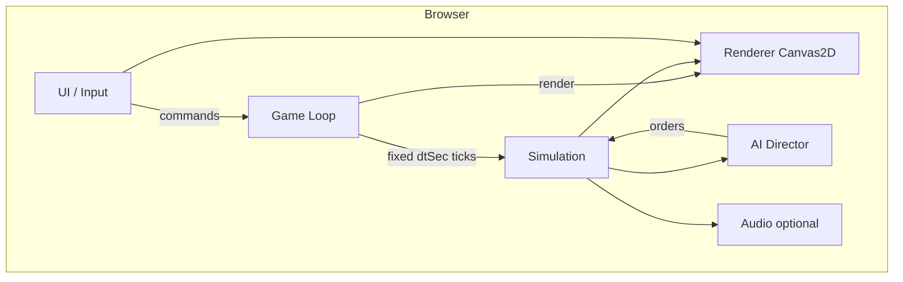
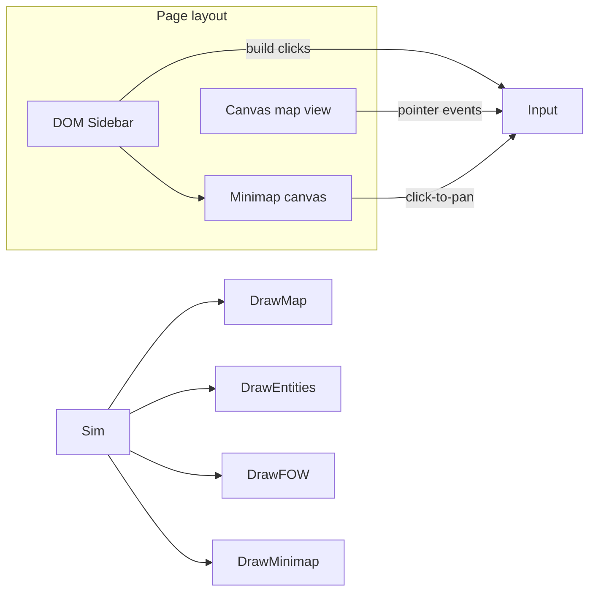
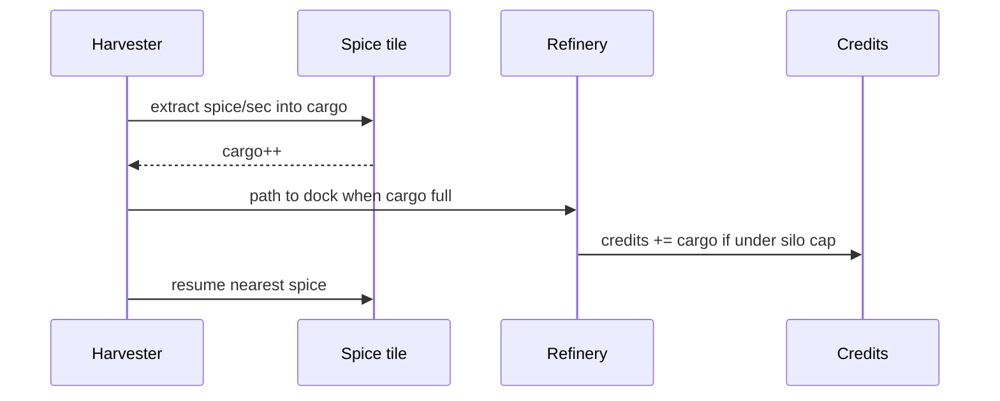
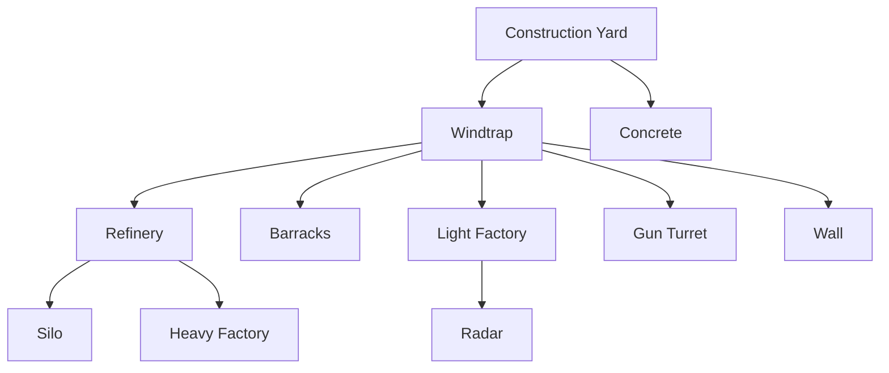
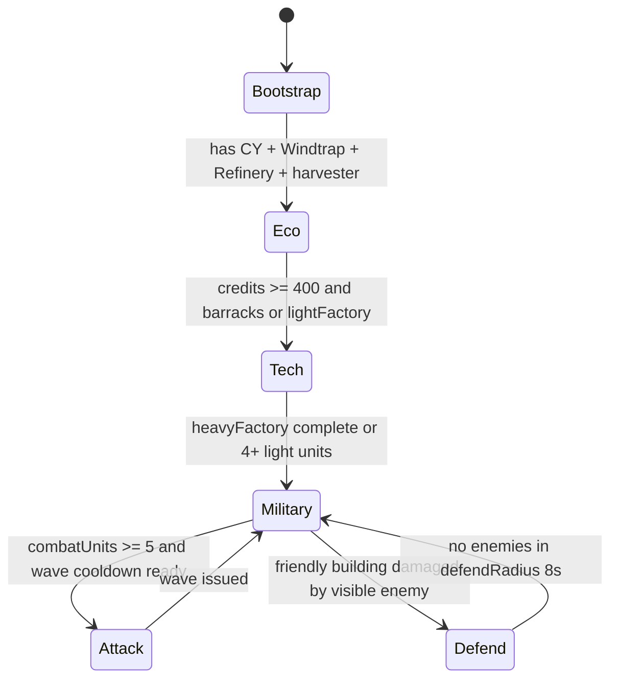
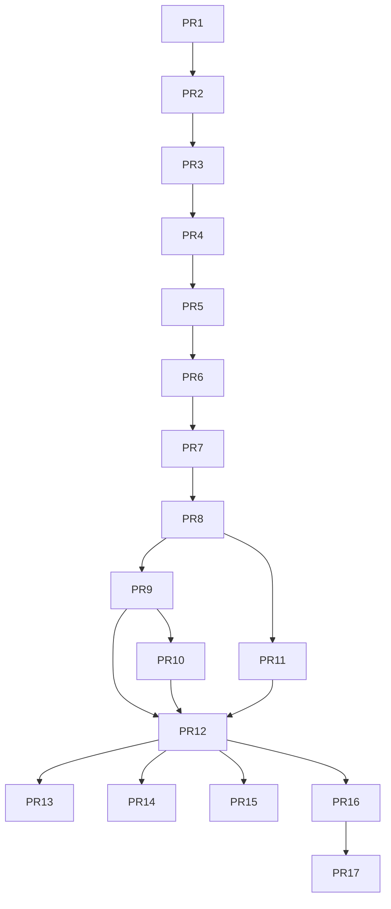

# Dune II Browser Clone — Design Document

| Field | Value |
|-------|-------|
| **Title** | Dune II: Single-Page HTML RTS Clone |
| **Author** | TBD |
| **Date** | 2026-07-27 |
| **Status** | Approved |
| **Target** | Playable skirmish RTS; **dev** multi-file static site, **release** single self-contained `dist/index.html` |
| **Inspiration** | *Dune II: The Building of a Dynasty* (Westwood, 1992) |
| **License** | MIT (code); unofficial fan project — not affiliated with rights holders |

---

## Overview

This document specifies architecture and phased delivery for a **browser-native HTML clone** of Dune II. The game captures the archetypal RTS loop—harvest spice, refine credits, build a base on rock, produce units, and destroy the enemy—without using licensed Westwood art, audio, or data.

**Development** uses a small multi-file static layout (HTML + CSS + JS modules as plain script tags) for clarity and Node-testable pure sim code. **Release** always produces one offline `dist/index.html` via `tools/pack.sh` that opens with double-click (`file://`) and plays with no server. Implementation uses **vanilla JavaScript + Canvas 2D**, with simulation logic cleanly separated from rendering.

Scope is phased: a **Playable Vertical Slice** (two bases, combat, debug enemy army) lands mid-ladder; the **MVP ship tag `v0.1.0`** is a full 1v1 skirmish (Atreides vs AI Harkonnen palette, FOW, AI, win/loss). Sandworms, save/load, and extra polish are feature-flagged post-MVP or late-MVP nice-to-haves. Later phases add Ordos/Harkonnen kits, full roster, and campaign.

---

## Background & Motivation

### Why Dune II

Dune II defined the modern RTS genre: sidebar build UI, resource harvesting, tech-gated production, power grids, and base destruction as win condition. A faithful-feeling browser clone is:

1. **Educational** — complete game architecture in a constrained package.
2. **Demonstrable** — zero install; share one HTML file.
3. **Scoped** — systems are well-documented by reverse-engineering communities and open-source ports (mechanics inspiration only), so design can be concrete without inventing genre rules.

### Current state

Workspace `/Users/mjog/dev/dune2` is greenfield aside from `request.md`. There is no existing engine, asset pipeline, or module structure. This design **is** the architecture.

### Pain points a naive approach would hit

| Risk | Impact |
|------|--------|
| Boiling the ocean (full campaign + 3 houses day one) | Never ships a playable build |
| Pixel-perfect DOS fidelity | Blocks modern UX and burns time on quirks |
| Licensed SHP/VOC assets | Legal exposure; must use procedural/original art |
| Monolithic untestable canvas code | AI, pathfinding, economy bugs become unfixable |
| Variable timestep combat | Desync feel; hard-to-reproduce balance |
| Underspecified combat/movement feel | Every PR invents different stacking and stats |
| Overlong PR ladder before fun | No feedback until month-end |

---

## Goals & Non-Goals

### Goals (v1 / MVP = tag `v0.1.0`)

- Playable **1v1 skirmish**: human Atreides vs AI enemy using **identical MVP unit/building stats**, **Harkonnen red palette** and name “Harkonnen” (no unique house units until post-MVP).
- Core loop: MCV → Construction Yard → power → refinery → harvest → factories → army → **defeat enemy (no CY and no MCV)**.
- **Spice economy** with harvesters, refinery docking, silo capacity; **finite spice fields** (no mid-match regen).
- **Terrain rules**: build on rock only; concrete optional HP bonus; sand movement; spice tiles.
- **Fog of war** per owner (explored sticky; classic Dune II style).
- **Power system**: Windtraps; low power slows production and can disable turrets.
- **Sidebar UI** inspired by original (build list, **minimap from early PRs**, credits, power bar).
- **Modern multi-select** + control groups (documented deviation).
- **Release artifact:** `dist/index.html` opens via `file://` and plays fully offline.
- **No backend**; no bundler required to develop or ship (pack script is shell concat only).
- Original / procedural graphics only.
- Competent scripted AI that respects FOW and can win if the player idles.

### Nice-to-have in v0.1.x (not blocking `v0.1.0`)

- Sandworms via **PR 13** behind `features.sandworms` / `config.worms.enabled` (**default off** at `v0.1.0` and until explicitly enabled).
- localStorage save/load.
- Web Audio UI blips.

### Non-Goals (v1)

- Full 9–14 mission campaign and world map.
- All three houses with unique campaigns and Mentat briefings.
- Pixel-perfect DOS resolution, original palette cycling, or exact unit stats.
- Multiplayer / networking / lockstep sim.
- WebGL, ECS framework libraries, React/Vue UI shells.
- Authentic single-unit selection only.
- MIDI/AdLib soundtrack recreation.
- Mobile touch-first controls (mouse/keyboard only).
- Camera zoom (pan-only).
- Scenario editor.

---

## Game Scope / MVP Definition

### Phase map


### Ship milestones

| Milestone | After PR | What “done” means |
|-----------|----------|-------------------|
| **Vertical Slice** | PR 8 | Two bases possible; combat works; debug “spawn enemy army” / give-credits; **no AI required**; manual skirmish fun |
| **MVP `v0.1.0`** | PR 12 | FOW, AI (respects FOW), win/loss, menu/restart, control groups, minimap, full MVP roster; pack script produces playable `dist/index.html` |
| **v0.1.x polish** | PR 13–15 | Sandworms, save/load, balance pass, expanded tests |
| **v0.2+** | PR 16–17 | House kits, campaign |

### MVP content table

| Category | Included in `v0.1.0` | Deferred |
|----------|----------------------|----------|
| **Houses** | Atreides (player), Harkonnen name/palette (AI); **same stats** | Ordos; unique house units/powers |
| **Buildings** | Concrete, CY, Windtrap, Refinery, Silo, Barracks, Light Factory, Heavy Factory, Gun Turret, Wall, Radar | WOR, Hi-Tech, Repair, Starport, IX, Palace, Rocket Turret |
| **Units** | Infantry, Trooper, Trike, Quad, Combat Tank, Harvester, MCV | Siege/Rocket Tank, Carryall, Ornithopter, Sonic Tank, Devastator, Death Hand, Deviator, Saboteur, Fremen, Raider |
| **Map** | One embedded skirmish map (`maps/skirmish1.js`, 64×64) | JSON map loader, random gen, campaign maps |
| **AI** | Expand → eco → army → waves; FOW-respecting | Adaptive difficulty, air micro |
| **Modes** | Skirmish + restart | Campaign, editor |
| **Persistence** | Not required for `v0.1.0` | localStorage |
| **Audio** | Silence / stub OK | Full SFX |
| **Worms** | **Off by default** at `v0.1.0`; PR 13 adds system behind flag (still default off) | Flag-on tuning / wormsign fantasy |

### Success criteria for MVP (`v0.1.0`)

1. Player can bootstrap from MCV to a functioning base without cheats.
2. Spice income supports continuous unit production for 15+ minutes on the skirmish map (finite fields sized for this).
3. Combat resolves with readable feedback (HP bars, explosions).
4. AI builds a base, scouts, harasses, and can win if player idles (Normal `config.ai`).
5. **Win/loss:** an owner is **defeated** when they have **zero Construction Yards and zero MCVs**. Opponent then wins. Concrete and Walls **do not** prevent defeat. Same rule for player and AI.
6. **Render** holds **≥30 FPS** (rAF) on a mid-range laptop at 1280×720 view; target ~60 FPS render when idle. Simulation is fixed **20 Hz** (independent of render FPS).
7. `tools/pack.sh` emits `dist/index.html` that plays offline via `file://`.

### Post-MVP phases

Aligned with phase map labels (and PR numbers):

- **P5 polish** (PR 13–15): sandworms, save/load, balance pass.
- **P6 houses** (PR 16): Ordos + Harkonnen player kits (Raider, Deviator, Devastator, Sonic Tank, etc.); IX / Palace as needed.
- **P6b air/starport** (with or after PR 16): Carryall, Ornithopter, Rocket Turret, Repair, Starport.
- **P7 campaign** (PR 17): mission runner (triggers, briefings).
- **P8 mentat** (after PR 17): Mentat panels, difficulty tiers, art pack polish.

---

## Proposed Design

### High-level architecture

Logical modules as separate `.js` files loaded by `index.html` (no bundler). Release concatenates into one file.



### Module layout (logical)

| Module | Responsibility |
|--------|----------------|
| `config.js` | Tunables: tile size, **full** unit/building tables, AI knobs, colors, features, RNG seed |
| `rng.js` | Seeded PRNG; all gameplay randomness goes through `Dune2.rng.next()` |
| `map.js` | Tile grid, terrain queries, spice amounts, **concrete flags**, occupancy, per-owner fog |
| `pathfinding.js` | A* on walkability grid |
| `entities.js` | Units, buildings, projectiles; factory helpers |
| `orders.js` | Issue/replace orders; rally; deploy validation |
| `economy.js` | Credits, power, build/unit queues, tech, silo cap |
| `combat.js` | Targeting, weapons cooldown, damage, death |
| `sandworm.js` | Worm spawn, attraction, swallow |
| `ai.js` | Enemy economy + military brain |
| `input.js` | Pointer, box select, hotkeys, camera pan, control groups |
| `ui.js` | Sidebar, build menu, selection panel, alerts, modals |
| `renderer.js` | Terrain cache, entities, FOW, minimap, overlays |
| `game.js` | State container, win/loss, init, reset |
| `loop.js` | rAF + fixed timestep accumulator (dt in **seconds**) |
| `save.js` | localStorage serialize/deserialize (post-MVP) |
| `main.js` | Wire modules, start loop |

### Entity model

Plain objects in arrays (not an ECS library):

```javascript
// Unit — positions in tile-space floats (tile center coords)
const Unit = {
  id, type, owner,           // owner: 'player' | 'enemy'
  x, y,                      // tile-space floats
  hp, hpMax,
  facing,                    // 0..7
  orders: [],                // at most one active order in MVP (see Orders)
  order,                     // current order or null (mirror of orders[0])
  path: [],                  // remaining waypoints in tile space
  weapon: null | {
    cooldownLeft,            // seconds remaining
    // static stats read from config.units[type].weapon
  },
  cargo: 0,                  // harvester spice units
  cargoMax: 0,
  harvest: null | {          // internal harvester FSM (not player order spam)
    state: 'idle' | 'moveToSpice' | 'harvest' | 'moveToRefinery' | 'unload' | 'seekRefinery',
    tileX, tileY, refineryId, unloadLeft,
  },
  sight,
  selected: false,
};

// Building
const Building = {
  id, type, owner,
  tileX, tileY, tileW, tileH,
  hp, hpMax,
  powered: true,             // false if under construction or special cases
  buildProgress: 1,          // 0..1 while constructing; 1 = complete
  buildQueue: [],            // unit production { type, progress, costPaid }
  rallyX, rallyY,            // tile-space rally
  dockTileX, dockTileY,      // refinery only: single dock tile
  // NOTE: no per-refinery `primary` flag in MVP — harvesters always use nearest dock
  sight,
};
```

**Why not ECS:** MVP entity counts are low (typically &lt;200 units). Plain arrays keep the single-file story simple.

### Game state root

```javascript
const Game = {
  phase: 'menu', // 'menu' | 'playing' | 'paused' | 'victory' | 'defeat'
  tick: 0,       // sim tick index
  credits: { player: 1000, enemy: 1000 }, // === baseSpiceCap; invariant credits[o] <= spiceCap[o]
  spiceCap: { player: 1000, enemy: 1000 }, // base cap; +siloBonus per completed silo
  structureBuilder: { player: null, enemy: null }, // buildingId currently constructing, or null (one-at-a-time)
  power: {
    player: { prod: 0, need: 0, ratio: 1 },
    enemy:  { prod: 0, need: 0, ratio: 1 },
  },
  map: MapState, // includes concrete: Uint8Array(w*h) foundation flags
  units: [],
  buildings: [],
  projectiles: [],
  worms: [],
  selection: { ids: [], box: null },
  controlGroups: { 1: [], 2: [], /* ... */ 9: [] },
  camera: { x: 0, y: 0 }, // world pixels; pan-only, no zoom
  fog: {
    player: { explored: Uint8Array, visible: Uint8Array }, // length = w*h
    enemy:  { explored: Uint8Array, visible: Uint8Array },
  },
  players: {
    player: { house: 'atreides', color: '#4a90d9' },
    enemy:  { house: 'harkonnen', color: '#c0392b' },
  },
  ai: { state: 'Bootstrap', waveAt: 0, memory: { /* last seen enemy CY tile, etc. */ } },
  messages: [], // sidebar alerts ring
  placement: null, // { type, valid }
  rngSeed: 1,
};
```

### Rendering approach

| Choice | Decision |
|--------|----------|
| API | **Canvas 2D** (map) + **DOM sidebar** |
| Tile size | **32×32 CSS pixels** logical; DPR-scaled backing store |
| Map size MVP | **64×64 tiles** → 2048×2048 world px |
| Camera | Pan WASD/arrows/edge/middle-mouse/**minimap click**; **no zoom** |
| Sprites | Procedural polygons; house color tints |
| Minimap | Second small canvas in sidebar from **PR 2**; click-to-pan |



**Sidebar contents (MVP):** credits, power bar, minimap, build tabs, selection info + HP, pause/restart.

**Radar mechanical effect:** Without Radar, minimap shows terrain + fog (explored/unexplored) + camera rect + friendly blips only. **With a completed Radar**, minimap also shows **enemy unit blips** that are currently in any friendly vision (same as main view rules), and paints explored enemy **building** blips permanently once explored. Radar does not reveal the whole map.

### Game loop — simulation time in seconds

**Critical:** all simulation rates use **seconds**. The loop converts wall-clock ms → a fixed `dtSec`.

```javascript
// loop.js
const SIM_HZ = 20;
const DT_SEC = 1 / SIM_HZ; // 0.05 seconds per sim tick — ONLY dt sim code sees
const MAX_FRAME_MS = 100;

let accMs = 0;
let lastMs = performance.now();

function frame(nowMs) {
  let frameMs = Math.min(nowMs - lastMs, MAX_FRAME_MS);
  lastMs = nowMs;
  accMs += frameMs;
  input.poll();
  while (accMs >= DT_SEC * 1000) {
    simulation.tick(Game, DT_SEC); // always 0.05
    accMs -= DT_SEC * 1000;
  }
  // MVP: no motion interpolation (entities have no prevX/prevY)
  renderer.draw(Game);
  requestAnimationFrame(frame);
}
```

| Concern | Choice |
|---------|--------|
| Sim rate | **20 Hz**, `dt = 0.05` **seconds** every tick |
| Render | rAF (~60 Hz); may redraw same sim state multiple times |
| Interpolation | **None in MVP**; optional later with double-buffered positions |
| Separation | `simulation.tick` never touches Canvas |
| Pause | freeze sim accumulator; still render UI |

**Worked movement example:**

- Combat Tank `speed = 1.2` tiles/sec  
- Per tick: `distance = speed * dtSec = 1.2 * 0.05 = 0.06` tiles/tick  
- Cooldown `1.2` s → `cooldownLeft` starts at `1.2`, subtract `dtSec` each tick → fires every 24 ticks  
- Build time `30` s at full power → `progress += dtSec / buildTime` each tick (× `powerRatio` when low power)

### Map & terrain model

**Tile types:**

| ID | Name | Build? | Walk speed mult | Notes |
|----|------|--------|-----------------|-------|
| 0 | Sand | No | 1.0 | Worm risk |
| 1 | Dune | No | 0.85 | Optional slow |
| 2 | Rock | Yes | 1.0 | Foundation |
| 3 | Spice | No | 1.0 | `spiceAmount` light default 200 |
| 4 | Spice heavy | No | 1.0 | `spiceAmount` default 500 |
| 5 | Cliff/unpathable | No | — | Borders / blockers |

**Spice (MVP locked):**

- Fields are **finite only** — no regeneration, no mid-match bloom spawns.
- Harvest extracts `harvestRate` spice/sec into cargo; tile becomes sand at 0.
- Conversion: **1 spice cargo → 1 credit** on unload (tunable `config.economy.spiceToCredit`).
- Map author sizes total spice for ~15+ min of play.
- Terminology: use **“spice field”** / **depletion**; do not imply regenerating “blooms” unless a post-MVP feature adds them.

**Concrete slabs (foundation layer — not a blocking building):**

- Placing concrete does **not** create a path-blocking entity. It sets `map.concrete[i] = 1` on that tile (and may spawn a short-lived build VFX only).
- Optional lightweight record in `buildings[]` with `type: 'concrete'` is allowed for selection/HP **only if** it has **`blocksPath: false`** and is ignored by occupancy/path grid. Prefer **flag-only** (no entity) for MVP simplicity; renderer tints slabbed rock.
- Concrete is **walkable**; pathfinding **ignores** it.
- Concrete is a **non-combatant**: never a valid attack/acquire target; cannot be damaged or selected as an enemy.
- Stacking a real building on concrete: `canPlace` allows non-concrete structures on rock tiles that may already have `concrete=1`; the building footprint then blocks as usual; concrete flag **remains** underneath for the HP bonus check.
- Buildings whose **entire** footprint has `map.concrete[i]=1` get **`hpMax * 1.20`** at completion. Bare rock (any footprint tile missing the flag) → normal HP.
- Destroying a building does **not** clear concrete flags (slabs persist).

**Build placement rules:**

1. Entire footprint on rock terrain (or rock that already has concrete flags). Sand/spice/cliff invalid.  
2. No overlap with **path-blocking** buildings (CY, factories, walls, turrets, etc.). Concrete flags do not count as overlap.  
3. Units **do not block** placement. On structure **completion**, any unit whose center lies on the new blocking footprint is **teleported** to the nearest walkable tile within 3 tiles (same helper as factory spawn escape). No continuous “push” simulation.  
4. Within **`config.economy.buildProximityTiles` (8)** of any **completed** friendly **path-blocking** building (CY counts; concrete flags do not count as proximity anchors).  
5. Wall segments auto-merge visually.  
6. First CY from MCV deploy: proximity waived.

### Unit collision, stacking, and pathfinding

**MVP collision model (intentional simplification vs classic Dune II):**

| Rule | Behavior |
|------|----------|
| Units vs pathfinding | **Units do not block** the path grid — **stacking allowed** |
| Path-blocking buildings / walls / cliffs | Mark tiles **unwalkable** |
| Concrete foundations | **Do not block**; path grid ignores `map.concrete` |
| Goal becomes building | Unit **repaths** or stops if no path |
| Multiple units same tile | Allowed; draw order by `id` |
| Factory/Barracks spawn | Spawn at building edge toward rally; if blocked by building geometry, spawn on nearest walkable tile within 2 tiles; units may stack on spawn |
| Unit under new building | On complete: **teleport** to nearest walkable within 3 tiles |
| Attack range | On `attack` / when engaging on `attack-move`, **stop moving when `dist <= range`** and fire; do not crowd into melee unless range is melee |
| Move order | Follow path to goal center; stop when `dist < 0.15` tiles |
| Diagonal movement | **No corner-cutting:** a diagonal step is invalid if either adjacent orthogonal tile is blocked |
| Repath budget | Max **`config.path.maxRepathsPerTick = 8`**; excess deferred to next tick |
| Path costs | sand=spice=rock=1, blocked=∞; optional dune=1.15 |

```javascript
// pathfinding diagonal check (8-connected)
function canStep(map, x, y, nx, ny) {
  if (!walkable(map, nx, ny)) return false;
  const dx = nx - x, dy = ny - y;
  if (dx !== 0 && dy !== 0) {
    if (!walkable(map, x + dx, y) || !walkable(map, x, y + dy)) return false;
  }
  return true;
}
```

### Fog of war (per-owner)

```javascript
// fog[owner].explored[i] : 0|1 sticky
// fog[owner].visible[i]  : 0|1 rebuilt every sim tick
// i = ty * map.width + tx
```

**Each tick, per owner:**

1. Clear `visible` to 0.  
2. For each friendly **completed path-blocking** building and living unit with `sight > 0`, stamp a filled sight disk (`sight` radius in tiles) setting `visible=1` and `explored=1`.  
3. Use circle fill / span stamp from entity positions — **do not** full-grid neighbor flood for vision.

**Stamp center (locked):**

| Entity | Center used for `stampSight` |
|--------|------------------------------|
| Unit | `tx = floor(x + 1e-6)`, `ty = floor(y + 1e-6)` |
| Building | Center of footprint: `tx = tileX + floor((tileW - 1) / 2)`, `ty = tileY + floor((tileH - 1) / 2)` — single disk of radius `sight` (not per-footprint-tile stamps) |
| Concrete | No sight (`sight: 0`); never stamps |

**Renderer (for local player):**

- Unexplored: black  
- Explored & not visible: dim terrain + **explored enemy buildings** (last known), no enemy units  
- Visible: full terrain + units + buildings  

**AI vision policy:** AI **respects FOW** (`config.ai.omniscient = false`). Attack targeting and “know player CY” use only `fog.enemy.visible` / `explored` plus **ai.memory** (last seen positions updated when enemy tiles are visible). Scouts refresh memory.

**Map API:**

```javascript
Dune2.Map.isVisible(game, owner, tx, ty) -> bool
Dune2.Map.isExplored(game, owner, tx, ty) -> bool
Dune2.Map.stampSight(game, owner, cx, cy, radius)
Dune2.Map.recomputeFog(game, owner) // clear visible + stamp all friendlies
```

### Economy & production



#### Power rules (locked)

- `powerRatio = prod/need` if `need > 0`, else `1`. Clamped to `[0, 1]`.  
- If `prod < need`: unit/structure **build queue** progress × `max(powerRatio, 0.25)`.  
- **Gun turrets** offline (no acquire/fire) if `powerRatio < 0.5`.  
- **Unit weapons ignore power** (combat always full rate).  
- **Harvester extract/unload ignore power**.  
- **Construction Yard** drains power (`power: -10`) but is **never disabled** by low power (always can queue structures; queues still slowed).  
- Destroying Windtraps mid-game recalculates power next tick; in-progress buildings keep progress, just slow/speed with ratio.  
- **Gun Turret tech stays after Windtrap only** (no Refinery gate) — final product decision; tune cost/HP/buildTime in balance PR if rushes dominate.

#### Build queues

- Credits **deducted when build/unit starts** (enters active slot); cancel refunds **50%** of `costPaid`.  
- **Structure concurrency (MVP locked):** **one structure constructing at a time per owner.** `game.structureBuilder[owner]` holds the in-progress building id (including concrete). Sidebar build buttons disabled while busy; `beginStructure` fails if non-null. Post-MVP may allow parallel.  
- **CY role:** Construction Yard does **not** hold a multi-item structure queue. It is the tech/presence gate + proximity anchor. Placement is validated globally for the owner; progress lives on the map entity’s `buildProgress`.  
- **CY destroyed mid-build:** in-progress structures **keep building** to completion (still consume the one-at-a-time slot until done). Owner **cannot start new** structures without a completed CY (or must deploy an MCV first). Consistent with win rule (MCV can still redeploy).  
- Structures: place ghost → building entity with `buildProgress 0→1` over `buildTime` seconds (concrete sets flag at completion instead of blocking footprint).  
- Units: factory `buildQueue` (factories may each run their own unit queue in parallel with each other); on complete, spawn near factory, apply rally as a **move** order.  
- **Credit cap invariant:** at all times after any gain, `credits[owner] <= spiceCap[owner]`. Enforced on unload and any cheat/debug credit grant (`credits = min(credits + gain, spiceCap)`). Spending (`charge`) only decreases credits. Starting credits equal base cap so t=0 satisfies the invariant.

#### Tech tree (MVP)



### Complete building stats (`config.buildings`)

Starting values — tune in balance PR. Times in **seconds**. Power: positive = production, negative = drain.

| type | name | cost | power | hp | buildTime | tileW | tileH | sight | requires | notes |
|------|------|------|------|-----|-----------|-------|-------|-------|----------|-------|
| `concrete` | Concrete | 5 | 0 | — | 2 | 1 | 1 | 0 | `constructionYard` | **Non-blocking** foundation flag; not a combat target; `blocksPath: false` |
| `constructionYard` | Construction Yard | — | -10 | 400 | — | 2 | 2 | 5 | — | **Deploy-only** from MCV; not in build menu |
| `windtrap` | Windtrap | 300 | **+100** | 200 | 30 | 2 | 2 | 2 | `constructionYard` | |
| `refinery` | Refinery | 400 | -30 | 450 | 40 | 3 | 2 | 3 | `windtrap` | Free harvester on complete; dock tile |
| `silo` | Silo | 150 | -5 | 150 | 20 | 2 | 2 | 2 | `refinery` | `+1000` spice cap |
| `barracks` | Barracks | 300 | -20 | 300 | 35 | 2 | 2 | 3 | `windtrap` | Trains infantry |
| `lightFactory` | Light Factory | 500 | -30 | 350 | 45 | 2 | 2 | 3 | `windtrap` | |
| `heavyFactory` | Heavy Factory | 600 | -40 | 400 | 50 | 3 | 2 | 3 | `refinery` | |
| `gunTurret` | Gun Turret | 125 | -20 | 200 | 25 | 1 | 1 | 4 | `windtrap` only | Early unlock kept; weapon below; offline if powerRatio &lt; 0.5 |
| `wall` | Wall | 50 | 0 | 80 | 8 | 1 | 1 | 0 | `windtrap` | Blocks path |
| `radar` | Radar | 400 | -30 | 250 | 40 | 2 | 2 | 5 | `lightFactory` | Minimap enemy blips when visible |

**Refinery dock:** footprint 3×2; **dock tile** is the middle cell of the longer southern edge relative to placement orientation. MVP: fixed **bottom-center** of footprint: `(tileX + 1, tileY + tileH)` clamped onto a walkable neighbor just outside footprint (first walkable of south edge centers). Only **one** harvester unloads at a time; others queue by waiting on nearby tiles (stacking OK) until dock free.

**CY deploy:** MCV may deploy when a 2×2 CY footprint centered on MCV’s tile occupancy is valid rock/placement (same rules as build, proximity waived if no buildings yet — **first CY exempt from proximity**).

**Spice / credit cap (locked, no start-of-game exception):**

| Knob | Value |
|------|-------|
| `startingCredits` | **1000** |
| `baseSpiceCap` | **1000** |
| Per completed Silo | `+ siloBonus` (**1000**) to `spiceCap` |

- Invariant: `credits[owner] <= spiceCap[owner]` always (including t=0).  
- Unload and other gains use `credits = min(credits + amount, spiceCap)`; if unload would add 0 because at cap, harvester **stalls** in unload with “Silos needed.”  
- UI may show both credits and cap (e.g. `1000 / 1000`).

### Complete unit stats (`config.units`)

Speeds in **tiles/sec**. Weapon `range` in tiles. `cooldown` in seconds. `buildTime` in seconds at full power.

| type | cost | builtAt | hp | speed | armor | sight | buildTime | cargoMax | weapon |
|------|------|---------|-----|-------|-------|-------|-----------|----------|--------|
| `infantry` | 60 | barracks | 45 | 0.7 | 0 | 3 | 12 | — | bullet dmg 4, rng 2.5, cd 0.8, vsI 1.0, vsV 0.4, vsB 0.25 |
| `trooper` | 100 | barracks | 55 | 0.65 | 0 | 3 | 15 | — | rocket dmg 8, rng 3.0, cd 1.4, vsI 0.5, vsV 1.3, vsB 0.6 |
| `trike` | 300 | lightFactory | 100 | 2.2 | 0 | 5 | 25 | — | bullet dmg 6, rng 3.0, cd 0.55, vsI 1.1, vsV 0.7, vsB 0.3 |
| `quad` | 400 | lightFactory | 140 | 1.8 | 1 | 4 | 30 | — | bullet dmg 9, rng 3.2, cd 0.7, vsI 0.9, vsV 1.0, vsB 0.35 |
| `combatTank` | 600 | heavyFactory | 220 | 1.2 | 2 | 4 | 40 | — | shell dmg 18, rng 4.0, cd 1.2, vsI 0.6, vsV 1.0, vsB 0.85 |
| `harvester` | 800 | heavyFactory | 150 | 1.0 | 0 | 3 | 35 | 700 | **none** (unarmed) |
| `mcv` | 2000 | heavyFactory | 180 | 0.8 | 0 | 3 | 60 | — | **none**; deploy → CY |

**Gun turret weapon** (`config.buildings.gunTurret.weapon`): shell dmg 14, rng 5.0, cd 1.0, vsI 0.7, vsV 1.0, vsB 0.5; `sight` 4.

**Harvester economy knobs** (`config.economy`):

```javascript
economy: {
  startingCredits: 1000,  // MUST equal baseSpiceCap at init
  baseSpiceCap: 1000,
  siloBonus: 1000,
  spiceToCredit: 1,
  harvestRate: 40,      // spice/sec while on spice tile in harvest state
  unloadRate: 350,      // spice/sec at dock → credits (full 700 cargo ≈ 2.0 s)
  cancelRefund: 0.5,
  buildProximityTiles: 8, // SINGLE key for proximity — do not also use config.build.*
  oneStructureAtATime: true,
}
```

**Enemy roster:** same table; red tint only.

### Harvester / refinery edge cases (locked)

| Case | MVP rule |
|------|----------|
| Spice regen | **None** |
| Choose refinery | **Nearest** completed friendly refinery by dock distance only (no player `primary` in MVP) |
| Dock busy | Wait within 1.5 tiles; retry every 0.5 s |
| Dock tile blocked by building | Pick alternate adjacent walkable tile to footprint at complete time; static per refinery |
| Cargo on death | **Lost** |
| Attacked while unloading | Take damage; stay in unload unless `hp` death or player issues move/attack; no cancel on chip damage |
| Refinery destroyed mid-trip | FSM → `seekRefinery`; if none, `idle` with cargo retained |
| Silo cap full | Unload **stalls** (remain in unload); ticker “Silos needed”; resume when cap rises or credits spent |
| Free harvester | Exactly one on each refinery **completion**; further harvesters from Heavy Factory only |
| Player harvest order | Sets internal FSM target spice; replaces current unit order with `harvest` controller |

Harvester FSM:

`idle → moveToSpice → harvest → moveToRefinery → unload → moveToSpice (loop)`  
Interrupts: player move/attack/stop; death; refinery lost → `seekRefinery`.

### Order system semantics (locked)

| Action | Semantics |
|--------|-----------|
| Default `Orders.issue` | **Replaces** the unit’s order queue with a single new order; clears path; interrupts harvest FSM if order is not harvest |
| Shift-queue | **Not in MVP** (post-MVP) |
| `stop` | Clears order + path; harvest FSM → idle; keeps location |
| `move` | A* to point; complete on arrival |
| `attack` | Path toward target until `dist <= range`, then fire; chase if target moves out of range; clear if target dies |
| `attack-move` | Path to point; if hostile enters **sight** and is **visible** (FOW), auto-acquire via `resolveTarget` until dead/lost; then resume move |
| `harvest` | Hands control to harvest FSM (internal states); not a multi-step player queue |
| `deploy` | MCV only; valid if 2×2 CY footprint legal; on success remove MCV, spawn CY at full HP |
| Buildings | Do **not** use unit orders; `setRally(buildingId, x, y)` only |
| AI | Must call the same `Orders.issue` / `Economy.*` / `setRally` APIs |

```javascript
// orders.js
Dune2.Orders.issue(game, unitIds, order) // replace
Dune2.Orders.stop(game, unitIds)
Dune2.Orders.setRally(game, buildingId, x, y)
Dune2.Orders.canDeploy(game, unitId) -> bool
```

### Combat & units

#### Target acquisition (`resolveTarget`) — locked

Callers: unit combat tick and gun turrets. **Skip entirely** if entity has no weapon def (harvester, MCV, concrete).

```javascript
// Pseudocode — single source of truth for PR 8 / AI
function resolveTarget(game, attacker) {
  const owner = attacker.owner;
  const def = weaponDef(attacker); // unit or turret
  if (!def) return null;

  // Turrets offline under low power
  if (attacker.isBuilding && game.power[owner].ratio < 0.5) return null;

  const order = attacker.order; // units only; turrets always "idle acquire"

  // 1) Explicit attack order: stick to id
  if (order && order.type === 'attack') {
    const t = entityById(game, order.targetId);
    if (!t || t.hp <= 0) return null; // order cleared by orders system
    // Keep chasing last id even if temporarily not visible (memory chase).
    // Do not fire while !isVisible; still path toward last known position if any.
    if (isEnemy(owner, t) && isValidCombatTarget(t)) {
      attacker._focusId = t.id;
      return t;
    }
    return null;
  }

  // 2) attack-move or idle military / turret: auto-acquire
  const acquire =
    !order || order.type === 'attack-move' || attacker.isBuilding;
  if (!acquire) return null; // pure move / harvest / deploy → no auto fire

  // Prefer current focus if still valid, visible, and within sight*1.25 (sticky)
  if (attacker._focusId) {
    const t = entityById(game, attacker._focusId);
    if (t && t.hp > 0 && isEnemy(owner, t) && isValidCombatTarget(t)
        && isVisible(game, owner, tileOf(t))
        && dist(attacker, t) <= sightOf(attacker) * 1.25) {
      return t;
    }
    attacker._focusId = null;
  }

  // Candidates: enemy units + path-blocking buildings, visible to owner, not concrete
  let best = null, bestScore = Infinity;
  for (const t of enemyCombatants(game, owner)) {
    if (!isValidCombatTarget(t)) continue;
    if (!isVisible(game, owner, tileOf(t))) continue;
    const d = dist(attacker, t);
    if (d > sightOf(attacker)) continue;
    // Prefer in-range targets, then nearer
    const score = (d <= def.range ? 0 : 1000) + d;
    if (score < bestScore) { bestScore = score; best = t; }
  }
  if (best) attacker._focusId = best.id;
  return best;
}

function isValidCombatTarget(t) {
  if (t.type === 'concrete') return false; // non-combatant foundation
  if (t.buildProgress < 1 && t.isBuilding) return true; // can shoot incomplete structures
  return t.hp > 0;
}

function isEnemy(owner, t) { return t.owner && t.owner !== owner; }
// Never friendly fire. Never target own units/buildings.
```

| Rule | Behavior |
|------|----------|
| Friendly fire | **Never** — only `owner !== attacker.owner` |
| FOW | Auto-acquire and **weapons fire** require `isVisible(attacker.owner, targetTile)` |
| Explicit `attack` order | Keep target **id** even if FOW drops (chase last id / last position); **hold fire** until visible again |
| Idle / attack-move / turret | Nearest visible enemy in **sight**; prefer already in **weapon range**; sticky focus until dead, leaves extended sight, or FOW lost |
| Turrets | Idle acquire only; no move orders; power gate above |
| No weapon | Skip (`harvester`, `mcv`) |
| Concrete | Not a target |
| Priority | (1) current sticky focus if valid (2) in-range visible (3) nearer sighted |

**Damage:**

```
mult = vsInfantry | vsVehicle | vsBuilding  // from target kind
final = max(1, floor(damage * mult) - armor)
hp -= final
```

**Target kind:** infantry/trooper → infantry; trike/quad/tank/harvester/mcv → vehicle; path-blocking buildings → building.

**Projectiles:** infantry/trike/quad **hitscan** (instant); tank/turret **projectile** entity at 8 tiles/sec for readability. Hitscan/projectile still require visible target at fire time.

**Death:** remove entity; path-blocking buildings free footprint tiles (concrete flags under them remain); emit `events` for AI/UI.

**Carryalls / air:** deferred.

### Sandworms (`config.worms`) — post-MVP PR 13; off by default

**Product decision:** Ship **`v0.1.0` without sandworms active.** PR 13 implements the system behind `features.sandworms` and `config.worms.enabled`, both **default `false`**. Enabling is a deliberate config/flag flip after MVP, not part of the ship bar.

```javascript
worms: {
  enabled: false,          // MUST remain false for v0.1.0; PR 13 keeps default off
  maxWorms: 2,
  moveWeight: { infantry: 1, trooper: 1, trike: 3, quad: 3, combatTank: 3, harvester: 4, mcv: 3 },
  harvestWeightBonus: 2,   // extra per second while harvesting on sand/spice
  threshold: 100,          // attraction points to emerge
  decayPerSec: 5,          // global heat cools slowly
  rumbleSec: 2.0,
  swallowRadiusTiles: 1.25,
  emergeRadiusTiles: 2,    // near hottest sand tile
  cooldownSec: 90,
  equalOpportunity: true,  // targets nearest sand unit of any owner
}
```

- Buildings immune; rock safe.  
- Wormsign **sidebar alert** only if rumble tile is **visible** to the player; optional audio always off in MVP.  
- AI: when pathing, prefer rock if path length ≤ 1.3× sand path (simple cost bias optional).  
- Attraction applies equally to player and AI units.

### AI (`config.ai`) — executable Normal defaults

```javascript
ai: {
  omniscient: false,           // respects FOW
  tickEvery: 10,               // sim ticks (0.5 s at 20 Hz)
  desirePowerSurplus: 0.20,    // (prod-need)/need
  wavePeriodSec: 90,
  waveMinCombatUnits: 5,       // infantry+vehicles with weapons, not harvesters/MCV
  defendRadiusTiles: 12,
  scoutPeriodSec: 45,
  creditsStableThreshold: 400, // "have a buffer" before heavy spending
  productionWeights: {
    // relative weights when queuing military
    infantry: 2,
    trooper: 2,
    trike: 2,
    quad: 2,
    combatTank: 4,
  },
  // Bootstrap build order (structures); skip if already owned/queued
  buildOrder: [
    'windtrap',
    'refinery',
    'windtrap',
    'barracks',
    'lightFactory',
    'heavyFactory',
    'gunTurret',
    'gunTurret',
    'silo',
    'radar',
    'windtrap',
  ],
  placement: {
    spiralMaxRadius: 12,
    refineryTowardSpiceRange: 20,
  },
}
```



**Roles (concrete):**

1. **Builder:** follow `buildOrder`; keep `prod >= need * 1.2`; place Windtraps via **spiral search** from CY; place Refinery on rock nearest spice within 20 tiles (dock toward spice).  
2. **Harvester manager:** maintain `harvesters >= refineries`; queue from Heavy Factory if short.  
3. **Production:** after Tech, roll weighted military units when `credits > creditsStableThreshold` and power OK.  
4. **Scout:** every 45 s send a Trike to a frontier unexplored tile or last-known enemy bearing.  
5. **Attack waves:** every 90 s if `combatUnits >= 5`, attack-move toward last-known enemy CY (memory) else nearest explored enemy building else explore direction.  
6. **Defend:** pull idle military within 12 tiles of damaged building to attack-move that point.

**Difficulty:** Normal = as above; Easy later = player resource mult 1.25; Hard later = AI starts with a free Silo (cap 2000) + 1500 credits, or credit trickle — never `credits > spiceCap` (not MVP).

### UI/UX

| Feature | MVP behavior |
|---------|--------------|
| Select | Click; **shift-add**; **drag box** |
| Control groups | Ctrl+1..9 assign, 1..9 recall (**with selection PR**) |
| Move | RMB empty ground |
| Attack | A+click or RMB enemy |
| Harvest | RMB spice (harvester) |
| Deploy MCV | Button or `D` if `canDeploy` |
| Build | Sidebar → ghost → LMB; **disabled while** `structureBuilder[owner]` set |
| Refinery primary | **None in MVP** — harvesters always nearest dock |
| Camera | WASD, arrows, minimap click, edge pan; **no zoom** |
| Pause | Space or P |
| Touch | **Not supported** |

**Modern multi-select** over DOS single-select: intentional.

### Persistence (post-MVP)

```javascript
function load(slot) {
  const raw = localStorage.getItem('dune2_' + slot);
  if (!raw) return null;
  const data = JSON.parse(raw);
  if (data.v !== SAVE_VERSION) {
    ui.toast('Save incompatible; starting new game.');
    return null; // ignore; do not crash
  }
  return rehydrate(pickKnownFields(data));
}
```

Save schema stores **per-owner** `fog.player.explored` / `fog.enemy.explored` (visible recomputed on load).

### Audio

MVP: stub `audio.play(...)` no-op. Optional oscillators later. No external binaries.

### Testing strategy

**Runner contract (zero npm deps):**

```bash
node --test tests/*.test.js
```

- Node 18+ built-in test runner.  
- `tests/setup.js` loads sim scripts via `fs.readFileSync` + `vm.runInContext` into a sandbox that provides `window`/`Dune2` globals (same order as `index.html` minus DOM modules).  
- Tests import helpers: `const { loadSim } = require('./setup')`.  
- `config.seed` initializes `Dune2.rng`; **never call `Math.random` in sim code**.  
- Manual checklist: **`playtest.md`** at repo root.

```
tests/
  setup.js
  pathfinding.test.js   # with PR 3
  economy.test.js       # with PR 5–6
  combat.test.js        # with PR 8
  fog.test.js           # with PR 9
playtest.md
```

### File layout

```
/Users/mjog/dev/dune2/
  index.html
  css/styles.css
  js/
    config.js
    rng.js
    map.js
    pathfinding.js
    entities.js
    orders.js
    economy.js
    combat.js
    sandworm.js
    ai.js
    input.js
    ui.js
    renderer.js
    game.js
    loop.js
    save.js
    main.js
  maps/
    skirmish1.js        # Dune2.MAPS.skirmish1 = { ... }  (embed only; no JSON fetch in MVP)
  tests/
    setup.js
    pathfinding.test.js
    economy.test.js
    combat.test.js
    fog.test.js
  tools/
    pack.sh             # → dist/index.html
  dist/                 # release artifact (gitignored or tagged builds)
  playtest.md
  request.md
  README.md             # file:// dev (multi script) + release pack instructions; MIT + fan attribution
```

**Module loading:** plain `<script src>` in dependency order — works on `file://` for multi-file **dev**. **Release:** `tools/pack.sh` inlines CSS/JS into one HTML (proven in PR 1 stub, full game in MVP).

### Performance budgets

| Metric | Target |
|--------|--------|
| Entities | ≤300 units+buildings |
| Map | 64×64 |
| Sim | &lt;8 ms per tick |
| Draw | &lt;12 ms/frame; minimap dirty ≤5 Hz |
| Memory | &lt;100 MB |
| Path | ≤8 repaths/tick; path length cap 512 nodes |
| FOW | Stamp from entities only; O(entities × sight²) not O(map²) full scans |

Terrain canvas cached; redraw terrain layer only on spice depletion / building place/destroy.

### Risks

| Risk | Severity | Mitigation |
|------|----------|------------|
| Scope creep | High | Hard MVP list; worms/save not blocking `v0.1.0` |
| Long ladder before fun | High | Vertical slice at PR 8 |
| Underspecified combat feel | Med | Locked stacking + full stat tables |
| Pathfinding CPU | Med | Repath cap; unit non-blocking |
| AI dumb or cheats | Med | `config.ai` numbers; FOW required |
| FOW/minimap bugs | Low | Per-owner model; tests |
| Early turret rush | Low | Accepted; balance PR |
| Balance broken | Med | Single `config.js`; playtest.md |
| file:// multi-script quirks | Low | Release single-file pack |

---

## API / Interface Changes

### Orders

```javascript
Dune2.Orders.issue(game, unitIds, { type: 'move', x, y })
Dune2.Orders.issue(game, unitIds, { type: 'attack', targetId })
Dune2.Orders.issue(game, unitIds, { type: 'attack-move', x, y })
Dune2.Orders.issue(game, unitIds, { type: 'harvest', tileX, tileY })
Dune2.Orders.issue(game, unitIds, { type: 'deploy' })
Dune2.Orders.stop(game, unitIds)
Dune2.Orders.setRally(game, buildingId, x, y)
Dune2.Orders.canDeploy(game, unitId) -> bool
```

### Economy

```javascript
Dune2.Economy.canAfford(game, owner, cost) -> bool
Dune2.Economy.charge(game, owner, cost) -> bool
Dune2.Economy.tickPower(game)
Dune2.Economy.enqueueUnit(game, buildingId, unitType) -> Result
Dune2.Economy.beginStructure(game, owner, type, tileX, tileY) -> Result
Dune2.Economy.cancelQueue(game, buildingId, index) -> void
```

### Map / Path / Fog

```javascript
Dune2.Map.tileAt(map, tx, ty) -> terrainId
Dune2.Map.hasConcrete(map, tx, ty) -> bool
Dune2.Map.setConcrete(map, tx, ty) -> void          // foundation flag only
Dune2.Map.blocksPath(map, tx, ty) -> bool           // buildings/walls/cliffs; NOT concrete
Dune2.Map.canPlace(game, type, tx, ty, owner) -> bool
Dune2.Map.recomputeFog(game, owner)
Dune2.Map.isVisible(game, owner, tx, ty) -> bool
Dune2.Map.isExplored(game, owner, tx, ty) -> bool
Dune2.Map.stampSight(game, owner, cx, cy, radius)   // cx,cy integer tiles
Dune2.Path.find(map, x0, y0, x1, y1) -> {x,y}[] | null
Dune2.Combat.resolveTarget(game, attacker) -> entity | null
```

### Renderer

```javascript
Dune2.Renderer.draw(game)                 // no alpha in MVP
Dune2.Renderer.drawMinimap(ctxMini, game)
Dune2.Renderer.worldToScreen(camera, x, y)
Dune2.Renderer.screenToWorld(camera, sx, sy)
```

---

## Data Model Changes

### Map embed (`maps/skirmish1.js`)

```javascript
Dune2.MAPS.skirmish1 = {
  version: 1,
  width: 64,
  height: 64,
  // row-major terrain ids only (numbers)
  tiles: [/* length 4096: 0 sand, 2 rock, 3 spice, ... */],
  spiceAmount: [/* length 4096, 0 if non-spice */],
  // concrete flags are runtime-only (start all 0); not authored in map file
  spawns: {
    player: { x: 8, y: 52, unit: 'mcv' },
    enemy:  { x: 55, y: 8, unit: 'mcv' },
  },
  wormZones: [{ x: 32, y: 32, r: 12 }],
};
```

No separate JSON fetch in MVP.

### Save schema (post-MVP)

```json
{
  "v": 1,
  "tick": 12345,
  "credits": { "player": 4200, "enemy": 2100 },
  "spiceCap": { "player": 2000, "enemy": 1000 },
  "map": { "spiceAmount": [] },
  "fog": {
    "player": { "explored": [] },
    "enemy": { "explored": [] }
  },
  "units": [],
  "buildings": [],
  "ai": { "state": "Military", "waveAt": 3, "memory": {} },
  "rngState": 123456
}
```

---

## Alternatives Considered

### 1. WebGL / PixiJS / Phaser

- **Pros:** Faster batches, sprite tooling.  
- **Cons:** Dependencies; hurts single-file offline story; overkill for ≤300 entities.  
- **Verdict:** Reject for MVP; Canvas 2D.

### 2. Full ECS library

- **Pros:** Scales.  
- **Cons:** Indirection; harder in one HTML file.  
- **Verdict:** Plain entity arrays.

### 3. OpenDUNE / original data files

- **Pros:** Authentic.  
- **Cons:** Copyrighted PAKs.  
- **Verdict:** Reject assets; mechanics inspiration only.

### 4. Authentic single-select + DOS resolution

- **Pros:** Museum accuracy.  
- **Cons:** Poor modern UX.  
- **Verdict:** Multi-select; 32px tiles; widescreen.

### 5. TypeScript + Vite

- **Pros:** Types.  
- **Cons:** Toolchain vs single-page constraint.  
- **Verdict:** JS first.

### 6. DOM-only tiles

- **Pros:** Easy UI.  
- **Cons:** DOM node count; FOW/minimap pain.  
- **Verdict:** Canvas map + DOM sidebar.

### 7. Canvas-only UI (no DOM sidebar)

- **Pros:** One surface; pixel-perfect chrome.  
- **Cons:** Text input, accessibility, build menus harder; focus management worse.  
- **Verdict:** DOM sidebar for a11y/text; canvas for world.

### 8. Utility AI / GOAP vs scripted FSM

- **Pros (utility):** Emergent behavior.  
- **Cons:** Harder to tune/test; overkill for one opponent.  
- **Verdict:** **FSM + build order + weights** for MVP; utility later if AI feels robotic.

### 9. Flow fields / boids vs grid A*

- **Pros (flow):** Cheap many-unit moves.  
- **Cons:** Implementation cost; stacking MVP reduces need.  
- **Verdict:** **Grid A*** with repath caps; flow fields if army sizes explode.

### 10. One scripted mission vertical slice vs skirmish-first

- **Pros (mission):** Smaller content; guided tutorial.  
- **Cons:** One-off trigger system before core loop solid; less replay.  
- **Verdict:** **Skirmish-first** so economy/combat/AI are general; campaign is Phase 7 on the same engine. Vertical slice (PR 8) gives mission-like manual testing without a scenario DSL.

---

## Security & Privacy Considerations

| Topic | Approach |
|-------|----------|
| Network | None; no telemetry |
| XSS | No untrusted `innerHTML`; UI text from code constants |
| localStorage | Game state only; version gate + field pick |
| Maps | MVP embeds only; future JSON: schema + size cap |
| Supply chain | Zero npm deps |
| **Copyright policy** | **MIT** for original code. Unofficial fan project; **not affiliated** with Herbert estate, Legendary, or former Westwood rights holders. **Allowed:** functional unit/building/house names as used in public discussion of the genre. **Forbidden:** Westwood art, audio, fonts, manual/Mentat verbatim prose, ripped data files. Flavor text must be original. |

---

## Observability

- **F3** debug overlay: render FPS, sim ms, unit count, AI state, credits, power, repaths this tick.  
- `config.debug` console levels.  
- Event ring (100) via `Dune2.dumpLog()`.  
- `?debug=1`: reveal map, +credits, spawn enemy army, spawn unit (for vertical slice).  
- Save mismatch: toast, ignore save (see Persistence).

---

## Rollout Plan

| Stage | Deliverable | Gate |
|-------|-------------|------|
| PR 1–2 | Shell, map, camera, **minimap** | Navigate map |
| PR 3–4 | Units, orders, buildings | MCV → CY → Windtrap |
| PR 5–7 | Economy + production | Full bootstrap |
| **PR 8 Vertical Slice** | Combat + debug spawns | Manual two-base fight |
| PR 9–11 | FOW + AI + win/loss menu | Idle-player loses |
| **`v0.1.0` MVP** | Pack dist + README | Success criteria |
| PR 13–15 | Worms, save, balance | `v0.1.x` |
| PR 16–17 | Houses, campaign | `v0.2+` |

**Feature flags:**

```javascript
features: {
  fog: true,
  ai: true,
  sandworms: false,
  saveLoad: false,
  debugCheats: false, // true if ?debug=1
}
```

**Rollback:** revert git tag; incompatible saves toast and ignore.

---

## Key Decisions

| # | Decision | Rationale |
|---|----------|-----------|
| 1 | **Canvas 2D + DOM sidebar** | Effort/quality; text UI a11y |
| 2 | **Dev multi-file, release single-file** | Clarity + tests; honors “single page” via `dist/index.html` |
| 3 | **Fixed 20 Hz sim; `dt` in seconds (`0.05`)** | One unit system for speed/cooldowns/build |
| 4 | **No render interpolation in MVP** | Avoid half-spec prevX/prevY |
| 5 | **Plain entity objects** | Low counts; readable |
| 6 | **Modern multi-select + control groups** | Playability |
| 7 | **Skirmish-first, not campaign** | General systems before scenario DSL |
| 8 | **Atreides vs Harkonnen palette; identical stats** | Cut unique units until core works |
| 9 | **Reduced tech tree** | Full loop; expandable config |
| 10 | **Procedural art only** | Legal safety |
| 11 | **Build proximity via sole key `config.economy.buildProximityTiles = 8`; first CY exempt** | Base cohesion; no dual keys |
| 12 | **Concrete = non-blocking foundation flags + optional +20% HP; not a combat target** | Walkable yards; stack buildings on slabs |
| 13 | **Free harvester with refinery** | Classic feel |
| 14 | **Sim pure / render impure** | Node tests |
| 15 | **AI uses player APIs; `omniscient: false`** | Fairness; FOW tests meaningful |
| 16 | **Script-tag `Dune2.*` namespaces** | `file://` dev |
| 17 | **Save/load not blocking MVP** | Ship skirmish first |
| 18 | **Win: no CY and no MCV = defeat** (walls/concrete ignored) | Clear `checkWinLoss()` |
| 19 | **Units stack; path-blocking buildings block; concrete does not; no corner cut** | Clog-resistant + foundations |
| 20 | **Finite spice; no regen** | Predictable economy |
| 21 | **Pan-only camera; no touch** | Scope cut |
| 22 | **MIT + fan attribution README** | Clear policy |
| 23 | **Seeded `Dune2.rng` only** | Deterministic tests |
| 24 | **Minimap from PR 2; Radar adds enemy blips** | Early overview UX |
| 25 | **MVP tag at PR 12; worms not in ship bar** | Thinner ship |
| 26 | **Power: slows production; turrets off &lt;0.5; weapons/harvest ignore** | Predictable combat |
| 27 | **Orders replace (no shift-queue MVP)** | Simple input/AI parity |
| 28 | **Gun turret cost 125; early unlock after Windtrap kept** | Balance numbers later, not tech gate |
| 29 | **node --test + vm setup harness** | Zero-deps CI |
| 30 | **Repath ≤8/tick; FOW stamp from entities** | Perf bounds |
| 31 | **`startingCredits === baseSpiceCap === 1000`; gains clamp to cap** | No t=0 cap violation |
| 32 | **One structure at a time per owner; CY not a multi-build queue** | Classic pacing; simple state |
| 33 | **Target acquire: enemies only, FOW for fire, sticky focus, attack-id chase** | Shared unit/turret/AI combat |
| 34 | **Harvesters always nearest refinery (no primary UX in MVP)** | Avoid half-spec UI |
| 35 | **Units on completed footprint teleport ≤3 tiles** | No push sim; no stuck units |
| 36 | **FOW stamp: unit `floor(x)`, building footprint center tile** | Deterministic vision |
| 37 | **Sandworms off by default at `v0.1.0`; PR 13 behind flag (default still off)** | Ship skirmish first; worms are polish |
| 38 | **Gun Turret requires Windtrap only — no Refinery tech gate** | Keep early turrets; retune stats if rushes dominate |

---

## Open Questions

1. **Fine balance tuning** — tables above are starting points; final HP/costs/cooldowns after playtest (PR 14). Includes turret cost/HP if early rushes feel oppressive (tech tree stays Windtrap-only).  
2. **Post-MVP shift-queue and zoom** — demand-driven.

*(Sandworms default-off, early gun turrets kept, win condition, FOW, collision, spice, license, pan/touch, enemy roster, sim units — decided in Key Decisions.)*

---

## References

- [Dune II — Wikipedia](https://en.wikipedia.org/wiki/Dune_II)  
- User request: `/Users/mjog/dev/dune2/request.md`  
- Mechanics inspiration only: OpenDUNE, Dune Dynasty, Westwood RTS patterns  
- “Fix Your Timestep” — Glenn Fiedler  
- A* grid pathfinding; Node.js test runner docs  

---

## Implementation Notes for Engineers

### Boot sequence

1. Load scripts in order (or one packed file).  
2. `main.js` reads `Dune2.MAPS.skirmish1`.  
3. `Dune2.rng.seed(config.seed)`.  
4. Spawn player/enemy MCVs; credits; camera on player; fog all-zero.  
5. Menu → Start Skirmish → `loop.start()`.

### Coordinate systems

- **Tile:** integer `(tx, ty)`.  
- **Unit position:** float tile space.  
- **World px:** `tile * TILE_SIZE` (32).  
- **Screen:** world − camera (+ canvas offset).

### Selection

```javascript
onPointerUp(box) {
  game.selection.ids = game.units.filter(u =>
    u.owner === 'player' && worldRectIntersects(u, box)
  ).map(u => u.id);
}
// Ctrl+N: controlGroups[N] = selection.ids.slice()
// N: selection.ids = controlGroups[N] filtered to living
```

### Combat tick (`dt` seconds)

Uses `resolveTarget` from **Target acquisition** (single implementation in `combat.js`).

```javascript
function tickCombat(game, dt) {
  const attackers = [...game.units, ...game.buildings.filter(b => b.type === 'gunTurret')];
  for (const a of attackers) {
    const def = weaponDef(a);
    if (!def) continue; // harvester/MCV/etc.
    a.weapon.cooldownLeft = Math.max(0, a.weapon.cooldownLeft - dt);
    const target = resolveTarget(game, a);
    if (!target) continue;
    // Fire only if currently visible to attacker owner
    if (!Dune2.Map.isVisible(game, a.owner, tileOf(target))) continue;
    const d = dist(a, target);
    if (d <= def.range) {
      if (!a.isBuilding) clearMove(a); // stop at range
      if (a.weapon.cooldownLeft === 0) {
        fire(game, a, target);
        a.weapon.cooldownLeft = def.cooldown;
      }
    } else if (a.order && a.order.type === 'attack') {
      // path toward target (orders/movement system)
    }
  }
  integrateProjectiles(game, dt);
}
```

### Win/loss

```javascript
function isDefeated(game, owner) {
  const hasCY = game.buildings.some(b =>
    b.owner === owner && b.type === 'constructionYard' && b.buildProgress >= 1);
  const hasMCV = game.units.some(u => u.owner === owner && u.type === 'mcv');
  return !hasCY && !hasMCV;
}
// each tick: if isDefeated(player) => phase=defeat; if isDefeated(enemy) => victory
```

### Sidebar build flow

1. Select CY (or any time with completed CY) → list structures by tech.  
2. If `structureBuilder[owner]` set, structure buttons disabled (“Building…”).  
3. Placement ghost validity coloring (rock, no blocking overlap, proximity).  
4. `Economy.beginStructure` → sets `structureBuilder`, charges credits, `buildProgress` with `dt` and powerRatio.  
5. On complete: clear `structureBuilder`; if concrete, set `map.concrete` flags; if blocking building, mark path grid + teleport overlapping units; power recalc; free harvester if refinery; tech flags.

---

## PR Plan

Each PR leaves `main` runnable. **MVP ship = PR 12.** Worms/save/extra polish follow.

### PR 1: Project shell, loop (dt seconds), pack stub

- **Title:** `chore: scaffold shell, fixed-timestep loop, pack stub`
- **Files:** `index.html`, `css/styles.css`, `js/config.js`, `js/rng.js`, `js/loop.js`, `js/main.js`, `tools/pack.sh`, `README.md`
- **Depends on:** none
- **Description:** Layout canvas + sidebar chrome; rAF loop with **`DT_SEC = 0.05`**; `Dune2` namespace; seeded rng; config skeleton (tables may be partial stubs filled PR 4–8); README with multi-file `file://` and `tools/pack.sh` → `dist/index.html` stub proof; MIT + fan attribution. Debug FPS (render) display.

### PR 2: Map, terrain, camera, **minimap**

- **Title:** `feat: tile map, camera pan, and minimap click-to-pan`
- **Files:** `js/map.js`, `js/renderer.js`, `maps/skirmish1.js`, `js/config.js`, `js/input.js`, `index.html`, `css/styles.css`
- **Depends on:** PR 1
- **Description:** Tile grid; terrain colors; embedded map; camera pan; tile highlight; **minimap canvas** with terrain + camera rectangle + **click-to-pan**; visible-window terrain draw + terrain cache hook.

### PR 3: Entities, selection, control groups, pathfinding, tests

- **Title:** `feat: units, multi-select, control groups, A* moves`
- **Files:** `js/entities.js`, `js/orders.js`, `js/pathfinding.js`, `js/input.js`, `js/renderer.js`, `js/game.js`, `tests/setup.js`, `tests/pathfinding.test.js`
- **Depends on:** PR 2
- **Description:** Spawn test units; click/box/shift select; **Ctrl+# groups**; RMB move; A* with **no corner-cut**, units **non-blocking**; stop order; order **replace** semantics; geometric sprites; **pathfinding unit tests** via `node --test`.

### PR 4: MCV, buildings, walls footprints, placement

- **Title:** `feat: MCV deploy, structure placement, path blocking`
- **Files:** `js/entities.js`, `js/economy.js`, `js/ui.js`, `js/input.js`, `js/map.js`, `js/renderer.js`, `js/config.js` (full **building** table)
- **Depends on:** PR 3
- **Description:** Full `config.buildings` stats; MCV deploy → CY (first CY proximity exempt); ghost placement; **one structure at a time per owner**; **path-blocking footprints** (walls, CY, windtrap, etc.) mark unwalkable — **concrete does not block** (sets `map.concrete` flags only); Concrete + Windtrap (+ wall) buildable; unit teleport on complete if overlapping; sidebar structure buttons.

### PR 5: Power, credits, low-power rules

- **Title:** `feat: power grid, credits, low-power production penalty`
- **Files:** `js/economy.js`, `js/ui.js`, `js/config.js`, `tests/economy.test.js`
- **Depends on:** PR 4
- **Description:** Credits UI (`credits / spiceCap`); init **1000/1000**; power bar; CY drain; Windtrap prod; queue slowdown; turret offline threshold wired (turrets fire in PR 8); tests for charge/ratio and **cap invariant**.

### PR 6: Spice, harvesters, refinery, silos

- **Title:** `feat: finite spice harvest, dock, silo cap`
- **Files:** `js/economy.js`, `js/orders.js`, `js/entities.js`, `js/map.js`, `js/renderer.js`, `js/ui.js`, `js/config.js`, `tests/economy.test.js`
- **Depends on:** PR 5
- **Description:** **Unlock Refinery + Silo in build menu** with tech checks (Windtrap → Refinery → Silo); place-then-build via existing one-at-a-time structure flow; finite spice; harvester FSM + edge cases (death loses cargo, refinery lost → seek, stall on cap); free harvester on refinery complete; dock single-slot; nearest-refinery selection; silo +1000 cap; spice shading.

### PR 7: Unit production queues

- **Title:** `feat: barracks and factory production queues`
- **Files:** `js/economy.js`, `js/ui.js`, `js/entities.js`, `js/config.js` (full **unit** table), `js/orders.js` (rally)
- **Depends on:** PR 6
- **Description:** Full `config.units`; Barracks/Light/Heavy Factory; rally `setRally`; tech gates; spawn + move to rally; cancel 50% refund; all MVP units trainable.

### PR 8: Combat + **Vertical Slice** milestone

- **Title:** `feat: combat system and playable vertical slice`
- **Files:** `js/combat.js`, `js/entities.js`, `js/renderer.js`, `js/config.js`, `js/ui.js`, `tests/combat.test.js`, `playtest.md` (partial)
- **Depends on:** PR 7
- **Description:** Implement **`resolveTarget`** (enemies only, FOW fire gate, sticky focus, attack-id chase); stop-at-range; attack / attack-move; projectiles/hitscan; HP bars; death; **gun turrets** idle acquire + power gate; destroy path-blocking buildings (not concrete); `?debug=1` spawn enemy army / +credits (clamped to cap); **milestone: manual two-base war without AI**. Win/loss helper can exist but menu polish in PR 11.

### PR 9: Fog of war + Radar minimap blips

- **Title:** `feat: per-owner fog of war and radar blips`
- **Files:** `js/map.js`, `js/renderer.js`, `js/economy.js`, `js/config.js`, `tests/fog.test.js`
- **Depends on:** PR 8
- **Description:** `fog[owner].explored/visible`; stamp sight; renderer shroud; enemy units hidden; buildings persist when explored; minimap FOW; Radar enables enemy unit blips when visible.

### PR 10: Enemy AI (FOW-respecting)

- **Title:** `feat: skirmish AI with build order and attack waves`
- **Files:** `js/ai.js`, `js/game.js`, `js/config.js` (`config.ai`)
- **Depends on:** PR 9
- **Description:** FSM + `config.ai` numbers; shared orders/economy; scouts; waves; defend; memory of last-seen targets; **no omniscient cheat**.

### PR 11: Win/loss, menus, restart

- **Title:** `feat: victory-defeat, main menu, pause, restart`
- **Files:** `js/game.js`, `js/ui.js`, `index.html`, `css/styles.css`
- **Depends on:** **PR 8 only** (AI not required)
- **Description:** `isDefeated` = no CY and no MCV; victory/defeat modals; Start Skirmish menu; pause; restart. Merge after vertical slice for manual testing. **Validate full skirmish with AI after PR 10** (no hard dependency). PR 12 still requires PR 10.

### PR 12: MVP release — sidebar polish, pack, README

- **Title:** `release: v0.1.0 MVP polish and dist pack`
- **Files:** `js/ui.js`, `js/input.js`, `css/styles.css`, `tools/pack.sh`, `README.md`, `playtest.md`
- **Depends on:** PR 9, PR 10, PR 11
- **Description:** Selection info panel, event ticker, production progress UI, double-click select-by-type; verify **control groups**; run pack.sh; README success criteria; tag **`v0.1.0`**. **Sandworms remain off** (`features.sandworms: false`, `config.worms.enabled: false`).

### PR 13: Sandworms (post-MVP; flag default off)

- **Title:** `feat: sandworms with config weights`
- **Files:** `js/sandworm.js`, `js/renderer.js`, `js/config.js`, `js/ui.js`
- **Depends on:** PR 12
- **Description:** Implement worm system behind **`features.sandworms` and `config.worms.enabled` — both default `false`** (not enabled by landing this PR). Attraction table; rumble/swallow; visible-only wormsign UI; equal opportunity targeting. Document how to flip the flag for playtests.

### PR 14: Balance pass + expanded tests

- **Title:** `test: balance pass and expanded pure-sim coverage`
- **Files:** `tests/*`, `js/config.js`, `playtest.md`, `README.md`
- **Depends on:** PR 12
- **Description:** Playtest matrix; tune stats; more fog/AI smoke tests; document cheats.

### PR 15: Save/load

- **Title:** `feat: localStorage save-load with version toast`
- **Files:** `js/save.js`, `js/ui.js`, `js/config.js`
- **Depends on:** PR 12
- **Description:** Quicksave/load; per-owner fog; incompatible save toast; `features.saveLoad`.

### PR 16 (post-MVP): House kits

- **Title:** `feat: playable Harkonnen and Ordos unique rosters`
- **Files:** `js/config.js`, `js/entities.js`, `js/combat.js`, `js/ui.js`, `js/ai.js`
- **Depends on:** PR 12+
- **Description:** House select; unique units; stats; AI variants.

### PR 17 (post-MVP): Campaign runner

- **Title:** `feat: scripted mission maps and objectives`
- **Files:** `maps/mission*.js`, `js/scenario.js`, `js/ui.js`
- **Depends on:** PR 16
- **Description:** Triggers; briefings; 3-mission slice.

### PR dependency graph



Note: PR 11 does **not** depend on PR 10. After PR 10 lands, re-validate win/loss against live AI before PR 12.

**Milestones:** PR 8 = Vertical Slice · PR 12 = **MVP `v0.1.0`**

---

*End of design document.*
